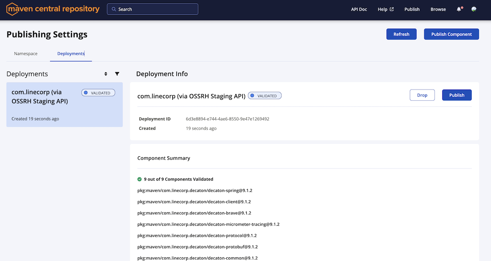

Making a new release
====================

## Preparation

This step is required only at the first time you release an artifact on Maven Central.

1. Create an account for Sonatype Central Portal following [guide](https://central.sonatype.org/register/central-portal/#create-an-account).
    * Then generate your user token from [account page](https://central.sonatype.com/account).   
2. Generate PGP key following this [guide](https://central.sonatype.org/publish/requirements/gpg/#generating-a-key-pair).
3. Distribute your public key to key servers following this [guide](https://central.sonatype.org/publish/requirements/gpg/#distributing-your-public-key).
4. Export the generated key for use from Gradle.
```sh
$ gpg --export-secret-keys KEY_ID > ~/.gradle/pgp-keyring.gpg 
```
5. Edit (or create) `~/.gradle/gradle.properties` with following content:
```properties
signing.keyId=// The last 8 symbols of the key ID that you can see with `gpg -K`
signing.secretKeyRingFile=/path/to/HOME/.gradle/pgp-keyring.gpg
signing.password=// Your PGP keyring password
sonatypeUsername=// Sonatype token's username that you confirmed at step 1
sonatypePassword=// Sonatype token's password you confirmed at step 1
```

## Releasing a new version

1. Check `:base_version:` of every documents under `./docs` to see if there's any article referring SNAPSHOT version. If any, strip SNAPSHOT suffix with carefully checking if the document is up-to-date with the version you're going to release. Then make a single commit to bump the document version and push it directly to the master branch.
2. Run `./script/publish.sh $RELEASE_VERSION`.
3. Upon successful exit, login to https://central.sonatype.com/ and go to [Publishing](https://central.sonatype.com/publishing).
4. Confirm you see an entry for decaton in deployments list. Check the content and press the "Publish" button. 
5. It will take some time to complete. When the status becomes "PUBLISHED", you're done! Against it takes some moment until it becomes visible to users. You can check out [maven central search](https://central.sonatype.com/search?q=decaton) to see if the version you released is now visible or not. 
6. Create a new release from the pushed tag from https://github.com/line/decaton/releases . You can copy the template from the past release notes. Unfortunately the construction of release note is manually done for now.


Migrating a PGP key from one machine to another
===============================================

ref: https://makandracards.com/makandra-orga/37763-gpg-extract-private-key-and-import-on-different-machine

1. Find a key ID to migrate: `gpg -K`
2. Export the key: `gpg --export-secret-keys KEY_ID > gpg-secret.key`
3. Move the key to another machine
4. Import the key: `gpg --import gpg-secret.key`
