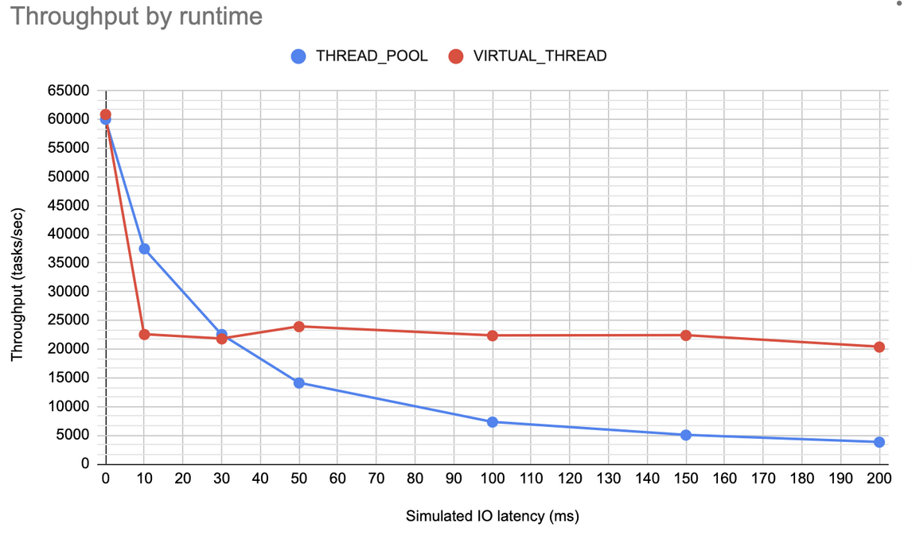
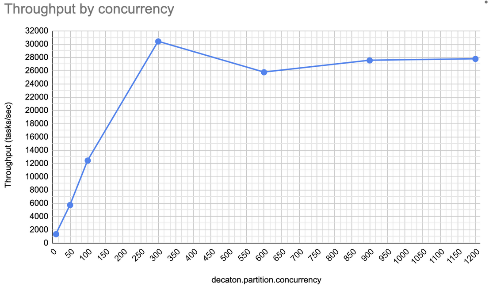

= Subpartition Runtime
:base_version: 8.0.0
:modules: processor

This document guides you what Subpartition Runtime is and how to use it.

Since `8.0.0` release, Decaton supports using different "Subpartition Runtime".
Subpartition is a core concept of Deacton to enable concurrent processing of one partition, and it has been implemented as the fixed count of queues with associated processing thread for each.
While it worked greatly to improve throughput of processing one partition, we also knew that sometimes the fixed number of threads left CPUs in idle, and limited throughput especially when the workload is heavily I/O intensive.
A typical workaround was to use `ProcessingContext#deferCompletion()` and use the returned `Completion` to asynchronously complete the task after returning from `DecatonProcessor#process()` method. It worked well in many production applications, but sometimes it caused a problem called "completion leak" leading the whole subscription to stuck and stop consuming the topic.

One possible solution for this problem is to use unlimited count of threads to process one partition, keeping serial processing constraints based on record keys, but creating such many platform (OS) threads is actually inefficient due to various costs like memory footprint and context switches, hence practically impossible. See <<Appendix>> for the performance characteristic with platform threads count.

Java 21 was released with https://docs.oracle.com/en/java/javase/21/core/virtual-threads.html[Virtual Threads] support, making it possible to create individual thread for each record key - the unit of guaranteeing serial processing in Decaton.

As of now there are two runtimes supported.

* `THREAD_POOL` - process one partition with the platform threads of count `decaton.partition.concurrency`
* `VIRTUAL_THREAD` - process each different key on a different virtual thread. `decaton.partition.concurrency` configuration is meaningless with this runtime. **Requires JDK21 or higher**

== Usage

Just set `SubPartitionRuntime` by calling `SubscriptionBuilder#subPartitionRuntime()`. By default it is set to `SubPartitionRuntime.THREAD_POOL`.

[source,java]
----
SubscriptionBuilder.newBuilder("my-subscription")
        .subPartitionRuntime(SubPartitionRuntime.VIRTUAL_THREAD)
...
        .build();
----

IMPORTANT: When using the `VIRTUAL_THREAD`, be extremely careful for the use of `synchronized` primitive in your/library code that might be executed in `DecatonProcessor#process()` method, as it results "pinning" the virtual thread and could eliminate performance gain of using virtual thread completely.
Visit https://docs.oracle.com/en/java/javase/21/core/virtual-threads.html#GUID-704A716D-0662-4BC7-8C7F-66EE74B1EDAD[Scheduling Virtual Threads and Pinned Virtual Threads] for the detail.

== Performance

As for the reference of performance characteristic of each runtime, here's the benchmarking result.

The machine spec used for the benchmark is as follows.

* CPU: Intel(R) Xeon(R) 2.20GHz, 8 core
* Memory: 16GiB

The benchmark was run using the https://github.com/line/decaton/tree/master/benchmark[benchmark module] with the following command line options.

[source]
----
./debm.sh \
  --title "Decaton" \
  --runner com.linecorp.decaton.benchmark.DecatonRunner \
  --runs 3 \
  --format json \
  --tasks 10000 \
  --warmup 100000 \
  --simulate-latency=$latency \
  --latency-count=5 \
  --param=decaton.partition.concurrency=300 \
  --param=decaton.subpartition.runtime={THREAD_POOL|VIRTUAL_THREAD}
----

We can read from the result that the `VIRTUAL_THREAD` runtime provides much stable throughput around 23k tasks/sec regardless to the amount of duration taken for I/O in processing a task.

== Appendix

=== `decaton.partition.concurrency` tuning

As written previously in this document, having too much platform (OS) threads causes significant overhead and throughput growth is capped at some point.
To learn where is that point, a benchmark was run to determine at which `decaton.partition.concurrency` value do we hit throughput peak.

The following command is used with increasing concurrency value. The machine spec is as same as <<Performance>>.

[source]
----
./debm.sh \
  --title "Decaton" \
  --runner com.linecorp.decaton.benchmark.DecatonRunner \
  --runs 2 \
  --format json \
  --tasks 10000 \
  --warmup 100000 \
  --simulate-latency=4 \
  --latency-count=5 \
  --param=decaton.partition.concurrency=$conc \
  --param=decaton.subpartition.runtime=THREAD_POOL
----

In this benchmark the processing logic simulates 5 continuous I/O with 4ms duration each. It is important to have multiple I/O during the benchmark because in real world applications there are more than one I/O performed in business logic, and that's where the cost of context switches come in.
From the result we can read that the maximum throughput could be achived when we have 300 threads for each partition, so in total, around 900 threads is maximum. (note that it could be very different on a different spec machine)
