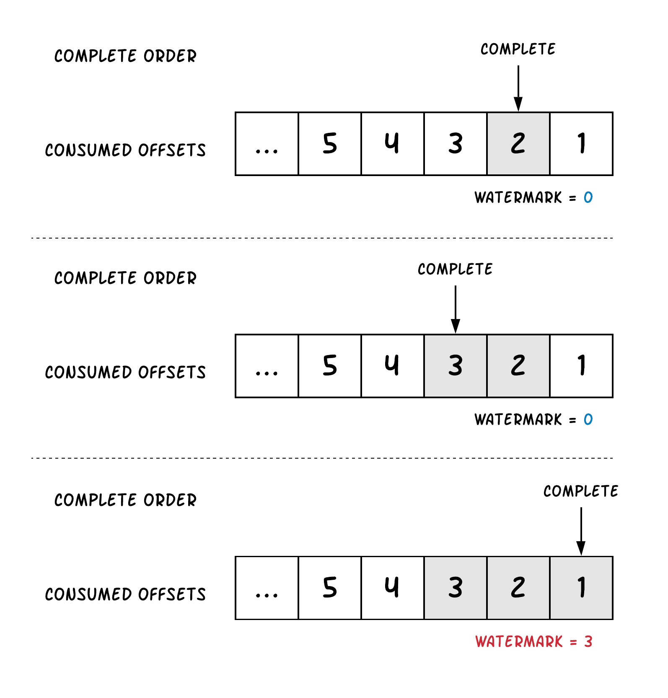
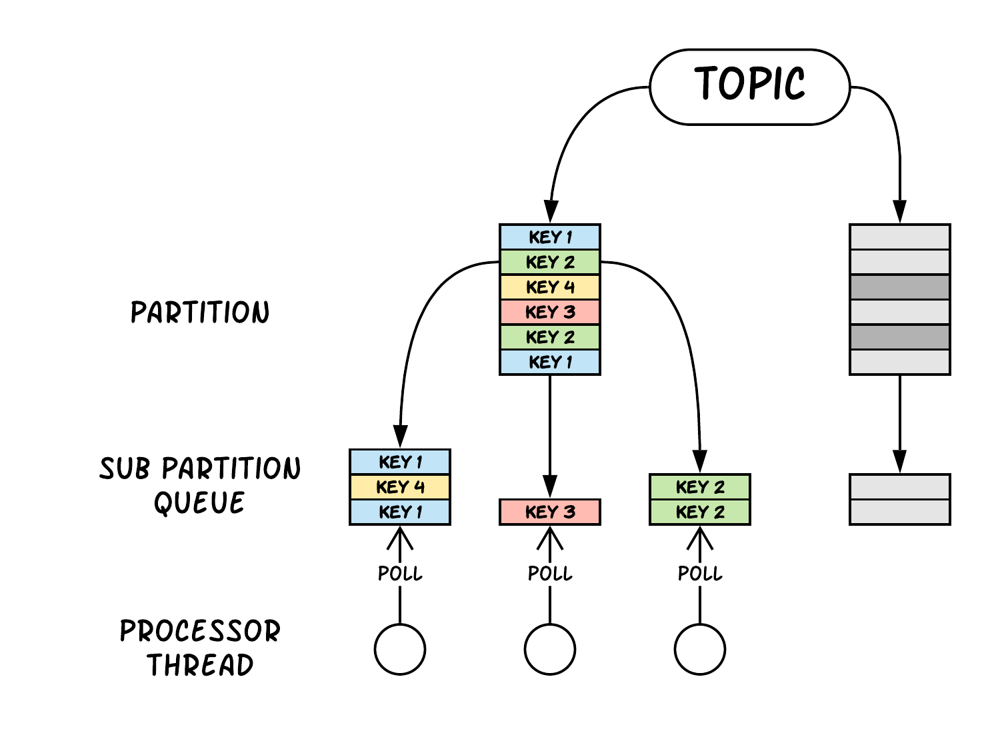

= Why Decaton
:base_version: 9.0.0
:modules: processor

This document explains why we have decided to create a new consumer framework.

== Concurrency requirement of Consumers

In Kafka, partition represents many different unit in many different places.

* In Producer, partitions are the unit of batches
* In Broker, partitions are the unit of replica assignment, log files, replication stream and is the factor to decide software/hardware resource usage such as file descriptors, memory mappings, concurrent sequential access to disks.
* In Consumer, partitions are the unit of assignment, serial processing and records ordering guarantee. At the same time it caps the maximum processing concurrency among entire topic.

When the topic contains tons of records that requires complex stream aggregation and computations to process them, we have to put more partitions to distribute the work for more machines.
However this isn't the case when consumer's processing logic is heavily IO intensive. For such tasks, the processing doesn't use that much of computation resource at running machine. Instead the most of its processing time is to wait response of IO from external system such as API server and storage middleware.
When the remote system has enough capacity to accepts more work from consumer instances, what becomes a bottleneck is often the limited concurrency (threads) in consumers because of the concurrency capped by the number of partitions.

=== More partitions?

We are thinking the model to rely only on partitions for processing concurrency has following problems:

* Problems of users
** Users cannot control concurrency (number of partitions) by themselves. Often the administrator of Kafka cluster differs from users of it who implements producers and consumers. It is natural for administrator to prohibit users to change the number of partitions by themselves for sane accounting and capacity planning. In this circumstance, users have to communicate, ask and wait administrator to change number of partitions every time they needs more concurrency, which makes both sides unhappy of course.
** It's difficult to estimate required concurrency from the beginning. However, 1. partitions can't be shrunk, and 2. expanding partitions has side-effects.
* Problems of administrators
** More partitions consumes more software/hardware resources. Single machine/process has limited count of file descriptors, memory mappings and HDD heads (even though OS does its best to utilize it max)
** Producers will generate smaller batches which isn't efficient for brokers to handle
** Since a link:https://blogs.apache.org/kafka/entry/apache-kafka-supports-more-partitions[Great Improvement] made from Kafka 1.1.0, some of link:https://www.confluent.io/blog/how-choose-number-topics-partitions-kafka-cluster[well known limitation] of having too many partitions had alleviated. However, since still the partition is the unit of replica assignment, having too much partitions on fewer brokers could cause reassignment process to slow down

=== To enable concurrent processing of single partition

To enable concurrent processing of single partition, we need coordination of offset commits.
Kafka's offset commit works in watermark manner. If we commit offset 5 for the partition, that implies all offset from 1 to 5 are committed.
If we consume offset 1 to 5 and process them concurrently using different threads, maybe the record of offset 5 completes processing first. Though we have to wait sending offset 5 to Kafka Consumer's `#commitXX` until all previous offsets 1 - 4 completes as well.

In short this is what Decaton takes care of (with highly optimized implementation) instead of you implementing it manually.
Decaton does it by sliding offset range, not by batching. See link:../processor/src/main/java/com/linecorp/decaton/processor/runtime/internal/OutOfOrderCommitControl.java[OutOfOrderCommitControl] for the implementation detail.

=== Internal queuing and workers

Once the offset commit coordination works, we can process records from single partition in parallel using multiple threads.

Decaton manages internal queues and associated threads to process records for each partition.
It relaxes ordering guarantee from partition-based to key-based and route each record into internal queue which will be consumed and processed by associated worker with logic that you supply.

